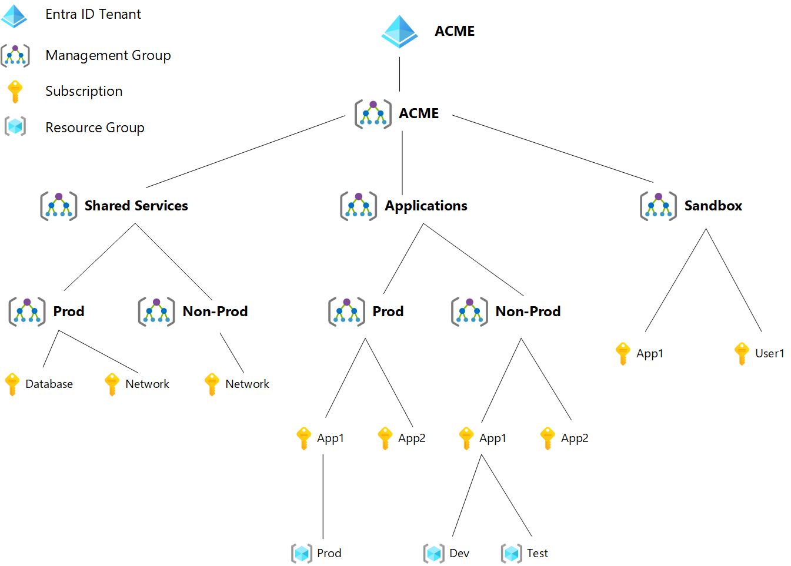

# ACME Corp Platform

This repository contains the documentation for ACME Corp's platform. Here you will find details on our platform architecture, guides to get you started deploying your application, and solutions to common problems.

## Getting Started

Getting started is easy, here are some guides for common scenarios:

* [Getting Started on Azure](getting_started_azure.md)
* [How to setup CI/CD](getting_started_cicd.md)
* [Setting up Terraform for deployment with Infrastructure-as-Code](getting_started_terraform.md)
* [Deploying a VM to Azure](getting_started_vms.md)
* [Deploying a Kubernetes Cluster](getting_started_kubernetes.md)

## Sandbox Environments

[Sandbox environments](sandboxes.md) are available upon request. These environments have very broad permissions and will allow you to experiment!

Please note that these environments are not connected to the corporate network and you should not place any production or sensitive data here.

## Recommended Services

While you are able to use any services on Azure that fit your needs, we provide a list of services that are recommended. You can expect these services to work well in ACME Corp's environment and for support to be available from other teams if you have issues.

[See the list here!](recommended_services.md)

## Security

Common security needs:

* [How to get access to Azure](security_iam.md)
* [How to handle secrets](security_handling_secrets.md) (passwords, certificates, etc.)
* [Azure Network Security](security_networking.md) (our network architecture & request firewall changes)

## Azure Architecture

Our Azure environment looks like this:

